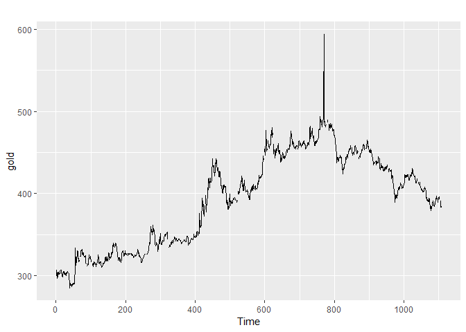
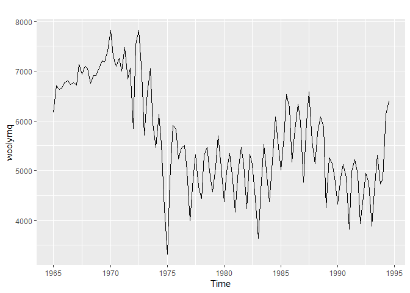
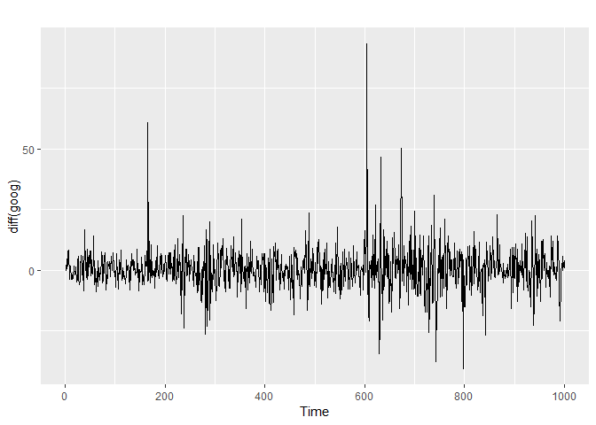

1\. Exploring timeseries in R
================

Author: Dennis W. Hallema

Description: Demonstration of time series exploration in R, and
signal/noise separation. (Inspired on a DataCamp course, own notes and
solutions.)

Disclaimer: Use at your own risk. No responsibility is assumed for a
user’s application of these materials or related materials.

-----

## Exploring and visualizing time series in R

``` r
# Load packages
library(readxl)

# Read the data from Excel into R
mydata <- read_excel("quarterly_sales.xlsx")

# Print the first few lines
head(mydata)
```

    ## # A tibble: 6 x 4
    ##   X__1   Sales AdBudget   GDP
    ##   <chr>  <dbl>    <dbl> <dbl>
    ## 1 Mar-81 1020.     659.  252.
    ## 2 Jun-81  889.     589   291.
    ## 3 Sep-81  795      512.  291.
    ## 4 Dec-81 1004.     614.  292.
    ## 5 Mar-82 1058.     647.  279.
    ## 6 Jun-82  944.     602   254

``` r
# Create ts object
myts <- ts(mydata[, 2:4], start = c(1981, 1), frequency = 4)
```

``` r
# Time series plots

# Load packages
library(forecast)

# Plot the data with facetting
autoplot(myts, facets = T)
```

<!-- -->

``` r
# Plot the data without facetting
autoplot(myts, facets = F)
```

<!-- -->

``` r
# Plot the three series
autoplot(gold)
```

<!-- -->

``` r
autoplot(woolyrnq)
```

<!-- -->

``` r
autoplot(gas)
```

<!-- -->

``` r
# Locate gold series maximum
goldoutlier <- which.max(gold)
print(paste("Time and value of gold maximum: ", goldoutlier, gold[goldoutlier]))
```

    ## [1] "Time and value of gold maximum:  770 593.7"

``` r
# Identify the seasonal frequencies of the three time series
frequency(gold)
```

    ## [1] 1

``` r
frequency(woolyrnq)
```

    ## [1] 4

``` r
frequency(gas)
```

    ## [1] 12

``` r
# Seasonal plots

# Load the fpp2 package
library(fpp2)

# Plot a10 data
autoplot(a10)
```

<!-- -->

``` r
ggseasonplot(a10)
```

<!-- -->

``` r
# Create a polar coordinate season plot for the a10 data
ggseasonplot(a10, polar = T)
```

<!-- -->

``` r
# Apply a window to the ausbeer data starting in 1992
beer <- window(ausbeer, start = 1992)

# Plot the beer data
autoplot(beer)
```

<!-- -->

``` r
ggsubseriesplot(beer)
```

<!-- -->

``` r
# Autocorrelation of non-seasonal time series

# Create an autoplot of the oil data
autoplot(oil)
```

<!-- -->

``` r
# Create a lag plot of the oil data
gglagplot(oil)
```

<!-- -->

``` r
# Create an ACF plot of the oil data
ggAcf(oil)
```

<!-- -->

``` r
# Autocorrelation of seasonal and cyclic time series

# Plot the annual sunspot numbers
autoplot(sunspot.year)
```

<!-- -->

``` r
ggAcf(sunspot.year)
```

<!-- -->

``` r
# Save the lag corresponding to maximum autocorrelation
maxlag_sunspot <- 1
```

The ACF of the annual sun spots time series (above) shows a maximum
autocorrelation with the preceding year, but also a high autocorrelation
for a lag of 10-11 years and 21-22 years. Both confirm the known 10-11
year solar cycle.

``` r
# Plot the traffic on the Hyndsight blog
autoplot(hyndsight)
```

<!-- -->

``` r
ggAcf(hyndsight)
```

<!-- -->

``` r
# Save the lag corresponding to maximum autocorrelation
maxlag_hyndsight <- 7
```

The 7, 14 and 21 day maximums in the ACF for the hyndsight web traffic
time series (above) reflect a weekly cycle. We would not be surprised to
discover that maximum

# Stock prices and white noise

How predictable are daily changes in Google stock price?

``` r
# Plot the original series
autoplot(goog)
```

<!-- -->

``` r
# Plot the differenced series
autoplot(diff(goog))
```

<!-- -->

``` r
# ACF of the differenced series
ggAcf(diff(goog))
```

<!-- -->

``` r
# Ljung-Box test of the differenced series
Box.test(diff(goog), lag = 10, type = "Ljung")
```

    ## 
    ##  Box-Ljung test
    ## 
    ## data:  diff(goog)
    ## X-squared = 13.123, df = 10, p-value = 0.2169

Ljung-Box is a test statistic for examining the null hypothesis of
independence, here evaluated in the time series of Google stock price
data for a range of *k* lags *jointly*. The null hypothesis is that the
first *k* autocorrelations are jointly zero.

  - p-value \< 0.05 (reject): the data are likely not serially
    independent (autocorrelations are not zero)
  - p-value \> 0.05 (not reject): the data may be be serially
    independent (autocorrelations are zero as in the case of white
    noise).

*How predictable are daily changes in Google stock price?* In the above
result we cannot reject the null hypothesis (p-value \> 0.05),
suggesting that the daily changes in the Google stock price over a lag
up to *k* = 10 time steps are random. This is in agreement with the
Efficient Market Hypothesis in economics that states that asset prices
reflect all available information. Assuming that all available
information is already priced into the current stock price, daily
changes in price are presumed random. This means that in terms of
forecasting, the current price is the best predictor of future price.

On a related note, we can use Ljung-Box in autoregressive integrated
moving average (ARIMA) modeling to test the null hypothesis of
independence of the time series of residuals (not of the original time
series). This is important because if the residuals are not independent
the model can be improved.
