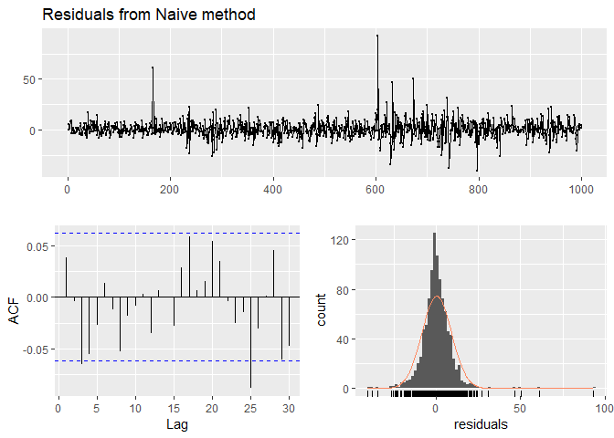

2\. Benchmark forecasting
================

Author: Dennis W. Hallema

Description: Demonstration of time series benchmark methods and their
use in evaluating time series forecasting models. (Inspired on a
DataCamp course, own notes and solutions.)

Disclaimer: Use at your own risk. No responsibility is assumed for a
user’s application of these materials or related materials.

-----

## Time series benchmark methods and forecasting accuracy

The simplest time series forecasting method is the mean method, where
the forecasts of all future values equal the mean of the historic
values. Naive forecasts are one step up, and assumes all future values
equal the value of the last observation (plus confidence interval).
Naive forecasts provide a useful benchmark for time series modeling.

``` r
# Load packages
library(fpp2)

# Forecast Google stock price
fcgoog <- naive(goog, h = 20)

# Plot and summarize the forecasts
autoplot(fcgoog)
```

<!-- -->

``` r
summary(fcgoog)
```

    ## 
    ## Forecast method: Naive method
    ## 
    ## Model Information:
    ## Call: naive(y = goog, h = 20) 
    ## 
    ## Residual sd: 8.7285 
    ## 
    ## Error measures:
    ##                     ME     RMSE      MAE        MPE      MAPE MASE
    ## Training set 0.4212612 8.734286 5.829407 0.06253998 0.9741428    1
    ##                    ACF1
    ## Training set 0.03871446
    ## 
    ## Forecasts:
    ##      Point Forecast    Lo 80    Hi 80    Lo 95    Hi 95
    ## 1001         813.67 802.4765 824.8634 796.5511 830.7889
    ## 1002         813.67 797.8401 829.4999 789.4602 837.8797
    ## 1003         813.67 794.2824 833.0576 784.0192 843.3208
    ## 1004         813.67 791.2831 836.0569 779.4322 847.9078
    ## 1005         813.67 788.6407 838.6993 775.3910 851.9490
    ## 1006         813.67 786.2518 841.0882 771.7374 855.6025
    ## 1007         813.67 784.0549 843.2850 768.3777 858.9623
    ## 1008         813.67 782.0102 845.3298 765.2505 862.0895
    ## 1009         813.67 780.0897 847.2503 762.3133 865.0266
    ## 1010         813.67 778.2732 849.0667 759.5353 867.8047
    ## 1011         813.67 776.5456 850.7944 756.8931 870.4469
    ## 1012         813.67 774.8948 852.4452 754.3684 872.9715
    ## 1013         813.67 773.3115 854.0285 751.9470 875.3930
    ## 1014         813.67 771.7880 855.5520 749.6170 877.7230
    ## 1015         813.67 770.3180 857.0220 747.3688 879.9711
    ## 1016         813.67 768.8962 858.4437 745.1944 882.1455
    ## 1017         813.67 767.5183 859.8217 743.0870 884.2530
    ## 1018         813.67 766.1802 861.1597 741.0407 886.2993
    ## 1019         813.67 764.8789 862.4610 739.0505 888.2895
    ## 1020         813.67 763.6114 863.7286 737.1120 890.2280

The seasonal naive approach is similar except that we set each forecast
equal to the last observed value of the same season. This is a good
benchmark for time series with a high level of seasonality.

``` r
# Forecast quarterly beer production in Australia
fcbeer <- snaive(ausbeer, h = 20)

# Plot and summarize the forecasts
autoplot(fcbeer)
```

<!-- -->

``` r
summary(fcbeer)
```

    ## 
    ## Forecast method: Seasonal naive method
    ## 
    ## Model Information:
    ## Call: snaive(y = ausbeer, h = 20) 
    ## 
    ## Residual sd: 19.1207 
    ## 
    ## Error measures:
    ##                    ME     RMSE      MAE      MPE    MAPE MASE       ACF1
    ## Training set 3.098131 19.32591 15.50935 0.838741 3.69567    1 0.01093868
    ## 
    ## Forecasts:
    ##         Point Forecast    Lo 80    Hi 80    Lo 95    Hi 95
    ## 2010 Q3            419 394.2329 443.7671 381.1219 456.8781
    ## 2010 Q4            488 463.2329 512.7671 450.1219 525.8781
    ## 2011 Q1            414 389.2329 438.7671 376.1219 451.8781
    ## 2011 Q2            374 349.2329 398.7671 336.1219 411.8781
    ## 2011 Q3            419 383.9740 454.0260 365.4323 472.5677
    ## 2011 Q4            488 452.9740 523.0260 434.4323 541.5677
    ## 2012 Q1            414 378.9740 449.0260 360.4323 467.5677
    ## 2012 Q2            374 338.9740 409.0260 320.4323 427.5677
    ## 2012 Q3            419 376.1020 461.8980 353.3932 484.6068
    ## 2012 Q4            488 445.1020 530.8980 422.3932 553.6068
    ## 2013 Q1            414 371.1020 456.8980 348.3932 479.6068
    ## 2013 Q2            374 331.1020 416.8980 308.3932 439.6068
    ## 2013 Q3            419 369.4657 468.5343 343.2438 494.7562
    ## 2013 Q4            488 438.4657 537.5343 412.2438 563.7562
    ## 2014 Q1            414 364.4657 463.5343 338.2438 489.7562
    ## 2014 Q2            374 324.4657 423.5343 298.2438 449.7562
    ## 2014 Q3            419 363.6190 474.3810 334.3020 503.6980
    ## 2014 Q4            488 432.6190 543.3810 403.3020 572.6980
    ## 2015 Q1            414 358.6190 469.3810 329.3020 498.6980
    ## 2015 Q2            374 318.6190 429.3810 289.3020 458.6980

``` r
# Check residuals 
goog %>% naive() %>% checkresiduals()
```

<!-- -->

    ## 
    ##  Ljung-Box test
    ## 
    ## data:  Residuals from Naive method
    ## Q* = 13.123, df = 10, p-value = 0.2169
    ## 
    ## Model df: 0.   Total lags used: 10

The residuals from the naive forecasts of Google stock price (above)
look like white noise.

``` r
# Check the residuals
ausbeer %>% snaive() %>% checkresiduals()
```

<!-- -->

    ## 
    ##  Ljung-Box test
    ## 
    ## data:  Residuals from Seasonal naive method
    ## Q* = 60.535, df = 8, p-value = 3.661e-10
    ## 
    ## Model df: 0.   Total lags used: 8

The residuals from the seasonal naive forecasts of quarterly beer
production in Australia (above) do not look like white noise. The ACF
and Ljung-Box test result point to a significant autocorrelation. This
means the residuals contain information that we can use to improve the
model.

## Evaluating forecast accuracy

``` r
# Create the training series
train <- subset(gold, end = 1000)

# Compute naive forecasts for validation series
naive_fc <- naive(train, h = 108)

# Compute mean forecasts
mean_fc <- meanf(train, h = 108)

# Compute RMSE statistics
accuracy(naive_fc, gold)
```

    ##                      ME      RMSE      MAE        MPE      MAPE     MASE
    ## Training set  0.1079897  6.358087  3.20366  0.0201449 0.8050646 1.014334
    ## Test set     -6.5383495 15.842361 13.63835 -1.7462269 3.4287888 4.318139
    ##                    ACF1 Theil's U
    ## Training set -0.3086638        NA
    ## Test set      0.9793153  5.335899

``` r
accuracy(mean_fc, gold)
```

    ##                         ME     RMSE      MAE       MPE      MAPE      MASE
    ## Training set -4.239671e-15 59.17809 53.63397 -2.390227 14.230224 16.981449
    ## Test set      1.319363e+01 19.55255 15.66875  3.138577  3.783133  4.960998
    ##                   ACF1 Theil's U
    ## Training set 0.9907254        NA
    ## Test set     0.9793153  6.123788

The naive forecasts have a lower RMSE than the mean forecasts.
Consequently, the naive forecasts are more accurate than the mean
forecasts. In the next example, we will compare the accuracy of seasonal
naive forecasts for training series of different lengths.

``` r
vn <- visnights

# Create three training series of different lengths
train1 <- window(vn[, "VICMetro"], end = c(2014, 4))
train2 <- window(vn[, "VICMetro"], end = c(2013, 4))
train3 <- window(vn[, "VICMetro"], end = c(2012, 4))

# Generate seasonally naive forecasts
fc1 <- snaive(train1, h = 4)
fc2 <- snaive(train2, h = 8)
fc3 <- snaive(train3, h = 12)

# Compute accuracy
accuracy(fc1, vn[, "VICMetro"])["Test set", "MAPE"]
```

    ## [1] 2.503255

``` r
accuracy(fc2, vn[, "VICMetro"])["Test set", "MAPE"]
```

    ## [1] 13.02567

``` r
accuracy(fc3, vn[, "VICMetro"])["Test set", "MAPE"]
```

    ## [1] 9.323252

The MAPE of the first training series is the lowest (see above),
indicating that this training series yields the best forecasts. In
addition to being longer, the first series also contains more recent
data which represents an important advantage in forecasting. A good
forecasting model has a small error (low RMSE) and white noise
residuals.

## Time series cross-validation

(In Econometrics called forecasting evaluation on a rolling origin.)

``` r
# Compute cross-validated errors for up to 8 steps ahead
e <- tsCV(goog, forecastfunction = naive, h = 8)

# Compute the MSE values
mse <- colMeans(e^2, na.rm = T)

# Plot the MSE values against forecast horizon
data.frame(h = 1:8, MSE = mse) %>%
  ggplot(aes(x = h, y = MSE)) + geom_point()
```

<!-- -->

The cross-validation MSE increases linearly with the forecasting
horizon, meaning that short term forecasts are more accurate than long
term forecasts.
