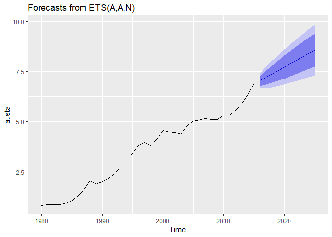
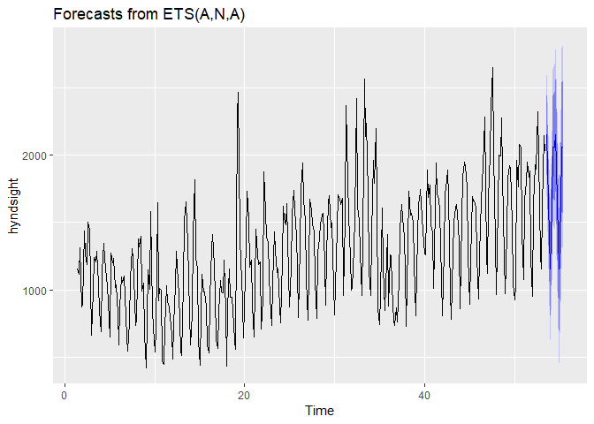

3\. Exponential smoothing
================

Author: Dennis W. Hallema

Description: Demonstration of exponential time series smoothing and
automatic model parameterization. (Inspired on a DataCamp course, own
notes and solutions.)

Disclaimer: Use at your own risk. No responsibility is assumed for a
user’s application of these materials or related materials.

Reference: Hyndman and others (2008), Forecasting with exponential
smoothing: the state space approach, Springer-Verlag: New York.

-----

## Exponentially weighted forecasts

Exponential smoothing uses an exponentially weighted moving average
(EWMA) for time series forecasting. This document explores several
methods for forecasting with EMWAs.

``` r
# Load packages
library(fpp2)

# Simple exponential smoothing forecast of next 10 years of Boston marathon winning times
fc <- ses(marathon, h = 10)

# Model parameters
summary(fc)
```

    ## 
    ## Forecast method: Simple exponential smoothing
    ## 
    ## Model Information:
    ## Simple exponential smoothing 
    ## 
    ## Call:
    ##  ses(y = marathon, h = 10) 
    ## 
    ##   Smoothing parameters:
    ##     alpha = 0.3457 
    ## 
    ##   Initial states:
    ##     l = 167.1741 
    ## 
    ##   sigma:  5.519
    ## 
    ##      AIC     AICc      BIC 
    ## 988.4474 988.6543 996.8099 
    ## 
    ## Error measures:
    ##                      ME     RMSE      MAE        MPE     MAPE      MASE
    ## Training set -0.8874349 5.472771 3.826294 -0.7097395 2.637644 0.8925685
    ##                     ACF1
    ## Training set -0.01211236
    ## 
    ## Forecasts:
    ##      Point Forecast    Lo 80    Hi 80    Lo 95    Hi 95
    ## 2017       130.3563 123.2835 137.4292 119.5394 141.1733
    ## 2018       130.3563 122.8727 137.8399 118.9111 141.8015
    ## 2019       130.3563 122.4833 138.2293 118.3156 142.3970
    ## 2020       130.3563 122.1123 138.6003 117.7482 142.9644
    ## 2021       130.3563 121.7573 138.9553 117.2053 143.5074
    ## 2022       130.3563 121.4164 139.2963 116.6839 144.0288
    ## 2023       130.3563 121.0880 139.6247 116.1816 144.5310
    ## 2024       130.3563 120.7708 139.9418 115.6966 145.0161
    ## 2025       130.3563 120.4639 140.2488 115.2271 145.4856
    ## 2026       130.3563 120.1661 140.5466 114.7717 145.9409

``` r
# Plot the forecasts with the training data
autoplot(fc) + autolayer(fitted(fc))
```

<!-- -->

Let’s compare the accuracy of 20-year simple exponential smoothing
forecasts vs naive forecasts of the Boston marathon winning times.

``` r
# Create a training set
train <- subset(marathon, end = length(marathon) - 20)

# Compute SES and naive forecasts, save to fcses and fcnaive
fcses <- ses(train, h = 20)
fcnaive <- naive(train, h = 20)

# Plot the forecasts with the training data
autoplot(fcses) + autolayer(fitted(fcses))
```

<!-- -->

``` r
autoplot(fcnaive) + autolayer(fitted(fcnaive))
```

    ## Warning: Removed 1 rows containing missing values (geom_path).

<!-- -->

``` r
# Calculate forecast accuracy measures
accuracy(fcses, marathon)["Test set", "RMSE"]
```

    ## [1] 2.493971

``` r
accuracy(fcnaive, marathon)["Test set", "RMSE"]
```

    ## [1] 2.462113

The test set RMSE of the naive forecasts is lower than that of the
simple exponential forecasts. This illustrates that more complex models
are not always more accurate.

## Holt’s trend corrected exponential smoothing

Holt (1957) extended simple exponential smoothing with a trend equation.
In other words, Holt’s trend corrected exponential smoothing involves a
forecast equation and two smoothing equations: 1. Smoothing equation for
the level 2. Smoothing equation for the trend

``` r
# Produce 10 year forecasts of austa using holt()
fcholt <- holt(austa, h = 10)

# Summary of fitted model
summary(fcholt)
```

    ## 
    ## Forecast method: Holt's method
    ## 
    ## Model Information:
    ## Holt's method 
    ## 
    ## Call:
    ##  holt(y = austa, h = 10) 
    ## 
    ##   Smoothing parameters:
    ##     alpha = 0.9999 
    ##     beta  = 0.0085 
    ## 
    ##   Initial states:
    ##     l = 0.656 
    ##     b = 0.1706 
    ## 
    ##   sigma:  0.1952
    ## 
    ##      AIC     AICc      BIC 
    ## 17.14959 19.14959 25.06719 
    ## 
    ## Error measures:
    ##                      ME      RMSE       MAE       MPE     MAPE      MASE
    ## Training set 0.00372838 0.1840662 0.1611085 -1.222083 5.990319 0.7907078
    ##                   ACF1
    ## Training set 0.2457733
    ## 
    ## Forecasts:
    ##      Point Forecast    Lo 80    Hi 80    Lo 95    Hi 95
    ## 2016       7.030683 6.780483 7.280882 6.648036 7.413330
    ## 2017       7.202446 6.847114 7.557778 6.659013 7.745879
    ## 2018       7.374209 6.937169 7.811249 6.705814 8.042604
    ## 2019       7.545972 7.039179 8.052765 6.770899 8.321045
    ## 2020       7.717736 7.148723 8.286748 6.847506 8.587965
    ## 2021       7.889499 7.263543 8.515455 6.932181 8.846816
    ## 2022       8.061262 7.382302 8.740222 7.022882 9.099642
    ## 2023       8.233025 7.504136 8.961915 7.118285 9.347766
    ## 2024       8.404788 7.628444 9.181133 7.217472 9.592105
    ## 2025       8.576552 7.754792 9.398311 7.319779 9.833324

``` r
# Plot the forecasts
autoplot(fcholt) + autolayer(fitted(fcholt))
```

<!-- -->

``` r
# Check the residuals
checkresiduals(fcholt)
```

<!-- -->

    ## 
    ##  Ljung-Box test
    ## 
    ## data:  Residuals from Holt's method
    ## Q* = 4.8886, df = 3, p-value = 0.1801
    ## 
    ## Model df: 4.   Total lags used: 7

The ACF (autocorrelation function) plot (above) shows that the
autocorrelation of residuals is within the range expected for an
independent series. This range is marked by the blue lines based on the
sampling distribution for the autocorrelation of white noise. Given the
limited data that we have, this may be considered an acceptable
forecast.

## Holt-Winters’ exponential smoothing corrected for trend and seasonality

Holt-Winters’ forecasting model extends simple exponential smoothing
with three smoothing equations: 1. Smoothing equation for the level 2.
Smoothing equation for the trend 3. Smoothing equation for seasonality.

Here we demonstrate this model using a time series of monthly
anti-diabetic drug sales in Australia from 1992 to 2008. For series with
a more-or-less constant amplitude of seasonality we can calculate
additive forecasts. For this series we will calculate multiplicative
forecasts because the seasonality increases with the level of the
series.

``` r
# Plot the data
autoplot(a10)
```

<!-- -->

``` r
# Produce 3 year forecasts
fc <- hw(a10, seasonal = "multiplicative", h = 36)

# Check if residuals look like white noise
checkresiduals(fc)
```

<!-- -->

    ## 
    ##  Ljung-Box test
    ## 
    ## data:  Residuals from Holt-Winters' multiplicative method
    ## Q* = 75.764, df = 8, p-value = 3.467e-13
    ## 
    ## Model df: 16.   Total lags used: 24

``` r
# Plot forecasts
autoplot(fc) + autolayer(fitted(fc))
```

<!-- -->

The ACF plot (above) shows that the residuals may be autocorrelated over
a lag of 3, 6, 9 and 12, meaning the quarterly and annual trends are not
fully captured by this Holt-Winters seasonal forecast model. However,
the residuals follow a normal distribution by approximation. All things
considered, this is still an acceptable forecast.

## Holt-Winters’ method for daily time series

``` r
# Create training data
train <- subset(hyndsight, end = length(hyndsight) - 28)

# Holt-Winters additive forecasts
fchw <- hw(train, seasonal = "additive", h = 28)

# Seasonal naive forecasts
fcsn <- snaive(train, h = 28)

# Identify best forecasts
accuracy(fchw, hyndsight)
```

    ##                     ME     RMSE      MAE       MPE    MAPE      MASE
    ## Training set -3.976241 228.2440 165.0244 -2.407211 13.9955 0.7492131
    ## Test set     -3.999460 201.7656 152.9584 -3.218292 10.5558 0.6944332
    ##                   ACF1 Theil's U
    ## Training set 0.1900853        NA
    ## Test set     0.3013328 0.4868701

``` r
accuracy(fcsn, hyndsight)
```

    ##                 ME     RMSE      MAE        MPE     MAPE      MASE
    ## Training set 10.50 310.3282 220.2636 -2.1239387 18.01077 1.0000000
    ## Test set      0.25 202.7610 160.4643 -0.6888732 10.25880 0.7285101
    ##                   ACF1 Theil's U
    ## Training set 0.4255730        NA
    ## Test set     0.3089795  0.450266

Its lower RMSE implies that Holt-Winters’ exponential smoothing
forecasts corrected for trend and seasonality are more accurate than the
seasonal naive forecast, which takes each prediction to be equal to the
last observed value of the same season. Here are the forecast plots of
both:

``` r
# Plot both forecasts
autoplot(fchw) + autolayer(fitted(fchw))
```

<!-- -->

``` r
autoplot(fcsn) + autolayer(fitted(fcsn))
```

<!-- -->

## Automatic forecasting with exponential models

To simplify the exponential smoothing options at our disposal, we can
write each method as an “innovations state space model”:

  - Error = {A, M} : Additive, multiplicative  
  - Trend = {N, A, A<sub>d</sub>} : None, additive, damped
  - Seasonality = {N, A, M} : None, additive, multiplicative

Indeed there are 3 x 3 x 2 = 18 models to choose from. Instead of going
through the process of fitting a model, plotting the ACF, the selecting
a possibly better model, we can estimate the parameters of all models
using the maximum likelihood approach, and then select the best model
with the corrected Akaike’s Information Criterion (AIC<sub>c</sub>).

The ETS performs the process of model fitting and model selection
automatically. We will do this for the international visitors to
Australia time series and the time series of daily pageviews for the
Hyndsight blog.

``` r
# Fit ETS model to austa
fitaus <- ets(austa)
checkresiduals(fitaus)
```

<!-- -->

    ## 
    ##  Ljung-Box test
    ## 
    ## data:  Residuals from ETS(A,A,N)
    ## Q* = 4.8886, df = 3, p-value = 0.1801
    ## 
    ## Model df: 4.   Total lags used: 7

``` r
autoplot(forecast(fitaus))
```

<!-- -->
*International visitors to Australia time series (result above):*

  - ETS selected an (A,A,N) exponential forecasting model as the best
    model–(additive error, additive trend, no seasonality).

  - The Ljung-Box test on the residuals of the fitted model yielded a
    p-value \> 0.05, indicating that the residuals are not
    autocorrelated (like in white noise).

  - Likewise, the ACF plot shows that autocorrelation remains within the
    range of the sampling distribution for the autocorrelation of white
    noise.

This is an acceptable model.

``` r
# Repeat for hyndsight data
fiths <- ets(hyndsight)
checkresiduals(fiths)
```

<!-- -->

    ## 
    ##  Ljung-Box test
    ## 
    ## data:  Residuals from ETS(A,N,A)
    ## Q* = 68.616, df = 5, p-value = 1.988e-13
    ## 
    ## Model df: 9.   Total lags used: 14

``` r
autoplot(forecast(fiths))
```

<!-- -->

*Time series of daily pageviews for the Hyndsight blog (result above):*

  - ETS selected an (A,N,A) exponential forecasting model as the best
    model–(additive error, no trend, additive seasonality).

  - Additive seasonality makes sense here, because the amplitude of the
    seasonality does not change much with the level. If it did, ETS
    might have found a better result with an (A,N,*M*) model, where *M*
    means a multiplicative seasonality forecast.

  - ETS preferred the (A,*N*,A) model (no trend) over the (A,*A*,A)
    (additive trend) and (A,*A<sub>d</sub>*,A) (damped trend) models.
    The plots shows there might be a positive trend in the beginning of
    the time series. However, ETS used only 14 lags to make a forecast,
    and over the course of 14 days most variation in web traffic might
    be explained by a weekly cycle.

  - The Ljung-Box test on the residuals of the fitted model yielded a
    p-value \< 0.05, indicating that the residuals are likely
    autocorrelated. The residual autocorrelation for lags shorter than 4
    days is possibly explained by the phenomenon where new blog posts
    attract addition traffic. The model does fully capture such patterns
    because they do not follow a regular trend and do not translate into
    a seasonality.

Although the Ljung-Box test failed we still consider this a useful
model.

## ETS vs seasonal naive

<!--

# Subset Portland cement dataset
cement <- subset(qcement, start = 240)

# Automatic forecast with ETS
fcets <- ets(cement)
checkresiduals(fcets)
autoplot(forecast(fcets, h = 4))

# Seasonal naive forecast
fcsn <- snaive(cement)
checkresiduals(fcsn)
autoplot(forecast(fcsn, h = 4))

-->

``` r
# Subset Portland cement dataset
cement <- subset(qcement, start = 96)

# Function to return ETS forecasts
fets <- function(y, h) {
  forecast(ets(y), h = h)
}

# Apply tsCV() for both methods
e1 <- tsCV(cement, fets, h = 4)
e2 <- tsCV(cement, snaive, h = 4)

# Compute MSE of resulting errors (watch out for missing values)
mean(e1^2, na.rm = T)
```

    ## [1] 0.02028123

``` r
mean(e2^2, na.rm = T)
```

    ## [1] 0.02813227

*ETS vs seasonal naive:* Here we used a subset of the quarterly
Australian Portland Cement production. Cross-validation computes the MSE
of predictions using a rolling forecast origin, which here points out
ETS as the winning model (lower MSE than for seasonal naive).

A limitation of comparing cross-validation errors is that they do not
return a confidence interval. Hence, we established that the ETS model
performed better than the seasonal naive model, but not that it
performed *significantly* better.

## Limitations of ETS

``` r
# Plot the lynx series
autoplot(lynx)
```

<!-- -->

``` r
# Use ets() to model the lynx series
fit <- ets(lynx)

# Check residuals
checkresiduals(fit)
```

<!-- -->

    ## 
    ##  Ljung-Box test
    ## 
    ## data:  Residuals from ETS(M,N,N)
    ## Q* = 195.53, df = 8, p-value < 2.2e-16
    ## 
    ## Model df: 2.   Total lags used: 10

``` r
# Use summary() to look at model and parameters
summary(fit)
```

    ## ETS(M,N,N) 
    ## 
    ## Call:
    ##  ets(y = lynx) 
    ## 
    ##   Smoothing parameters:
    ##     alpha = 0.9999 
    ## 
    ##   Initial states:
    ##     l = 2372.8047 
    ## 
    ##   sigma:  0.9594
    ## 
    ##      AIC     AICc      BIC 
    ## 2058.138 2058.356 2066.346 
    ## 
    ## Training set error measures:
    ##                    ME     RMSE      MAE       MPE     MAPE     MASE
    ## Training set 8.975647 1198.452 842.0649 -52.12968 101.3686 1.013488
    ##                   ACF1
    ## Training set 0.3677583

``` r
# Plot 20-year forecasts of the lynx series
fit %>% forecast(h = 20) %>% autoplot()
```

<!-- -->

*Seasonality not detected in Lynx time series:* The best model ETS
proposes for the Lynx time series (above) is an ETS(M,N,N) with a
multiplicative error (possibly true), no trend (correct) and no
seasonality (incorrect). This model has a very high MAPE (Mean Absolute
Percentage Error), meaning that ETS failed to find an accurate solution.

Additional investigation divulged the cause: an inability to detect the
10-11 year cycle. Part of the non-stationarity in variance can be
captured by a multiplicative error, but the peaks are a challenge. An
Autoregressive Moving Average model (ARMA) is more appropriate for this
type of peaked time series.

<!--
*ETS vs seasonal naive:* Here we used a subset of the quarterly 
Australian Portland Cement production.  

* Comparing the residual ACFs and Ljung-Box test of indepence of 
residuals for the ETS selected 
"exponential smoothing state space model" forecasts and the seasonal 
naive forecasts, ETS comes out as the winner with an (M,N,M) model 
(multiplicative error, no trend, multiplicative seasonality). 

* However, after running time series cross-validation it appears that the 
ETS model returns a higher MSE than the seasonal naive model, suggesting 
that the seasonal naive model performed better than the ETS model.  

There is an important difference in interpreting the result of a 
Ljung-Box test of lagged residuals vs a cross-validation error of 
the time series using a rolling forecast origin. 
The first provides a p-value, which can become more significant 
(that is, lower) for a greater number of samples resulting in a higher 
value of the test statistic *Q* for the same number of degrees of freedom.  

Conversely, a cross-validation error does not come with 
a confidence interval, and is merely a measure of overall model performance. 

-->
