4\. ARIMA forecasting
================

Author: Dennis W. Hallema

Description: Demonstration of time series stationarization with Box-Cox
transformation and ARIMA time series forecasting. (Inspired on a
DataCamp course, own notes and solutions.)

Disclaimer: Use at your own risk. No responsibility is assumed for a
user’s application of these materials or related materials.

Reference: Guerrero, V.M. (1993) Time-series analysis supported by power
transformations. Journal of Forecasting, 12, 37–48.

-----

## Box-Cox transformations

Some forecasting methods, like exponential smoothing account for
non-stationarity in time series using equations for trend and
seasonality. However, generally speaking forecasting works best with
stationary time series. There can be different levels of stationarity,
but stationarity often involves a more-or-less constant mean and
variance over the duration of the time series. Box-Cox transformations
can help stabilize a time series by reducing the non-stationarity, which
we will do below for a series of monthly anti-diabetic drug sales in
Australia from 1991 to 2008.

``` r
# Load package
library(fpp2)

# Plot the series
autoplot(a10) +
  ggtitle("Original a10 series")
```

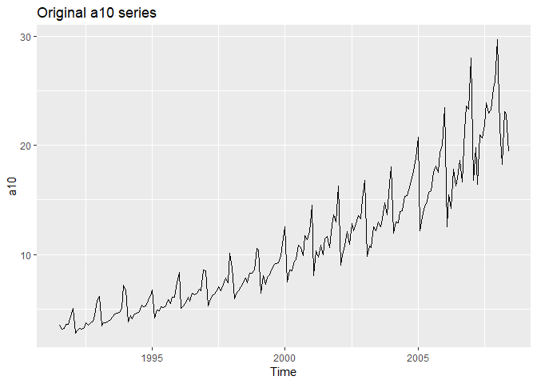<!-- -->

``` r
# Four values of lambda in Box-Cox
a10 %>% BoxCox(lambda = 0.5) %>% autoplot() + ggtitle("Box-Cox transformation (lamba = 0.5)")
```

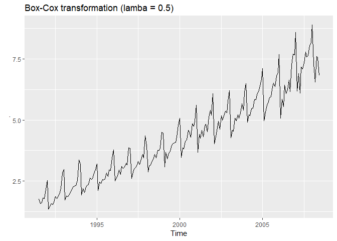<!-- -->

``` r
a10 %>% BoxCox(lambda = 0.1) %>% autoplot() + ggtitle("Box-Cox transformation (lamba = 0.2)")
```

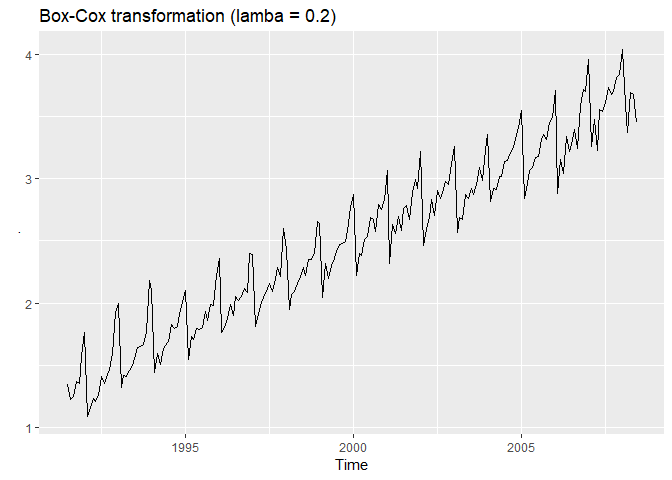<!-- -->

``` r
a10 %>% BoxCox(lambda = 0) %>% autoplot() + ggtitle("Box-Cox transformation (lamba = 0)")
```

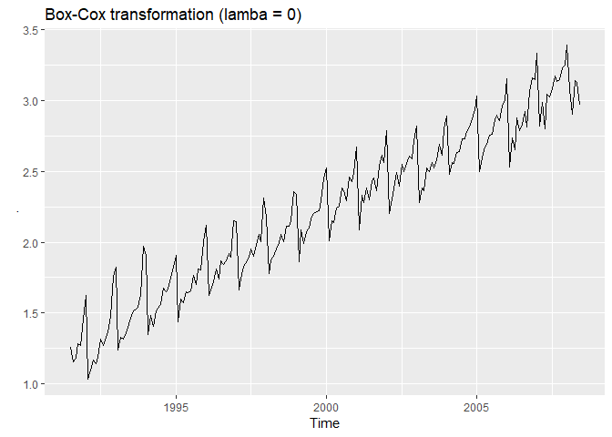<!-- -->

``` r
a10 %>% BoxCox(lambda = -1 ) %>% autoplot() + ggtitle("Box-Cox transformation (lamba = -1)")
```

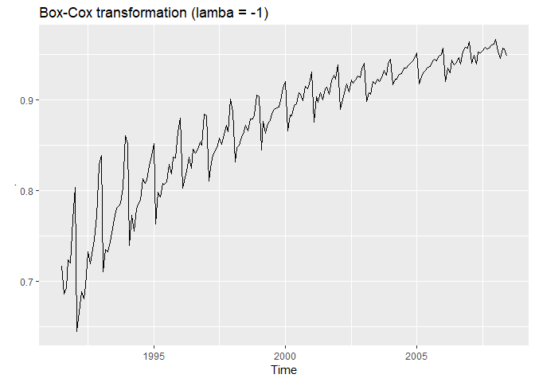<!-- -->

In the original series (above), the amplitude of variations around the
rising trend increases with time. Or, in terms of stationarity, the
variance increases with time. A Box-Cox transformation with lamba = 0.5
stabilizes the variance somewhat, but the variance still increases
toward the end of the series. A Box-Cox transformation with lamba = -1
attains the opposite effect. The amplitude at the beginning of the
series is now greater than at the end. Lamba = 0.2 gives a good result,
but improvement is still possible.

We can use Guerrero’s (1993) method to automatically select the Box-Cox
transformation parameter resulting in the smallest coefficient of
variation of the transformed series.

``` r
# Automatic selection of Box-Cox lamba parameter
BoxCox.lambda(a10)
```

    ## [1] 0.1313326

## Non-seasonal differencing for stationarity

``` r
# Plot US female murder rate
autoplot(wmurders)
```

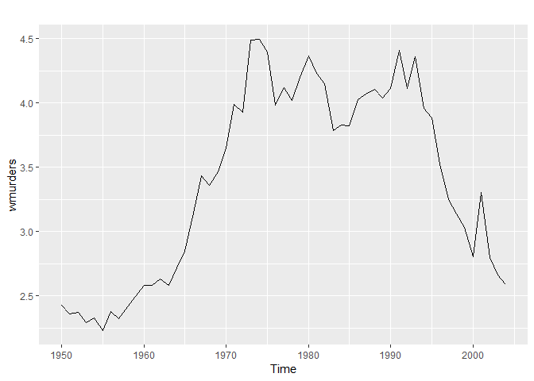<!-- -->

``` r
# Plot ACF
ggAcf(wmurders)
```

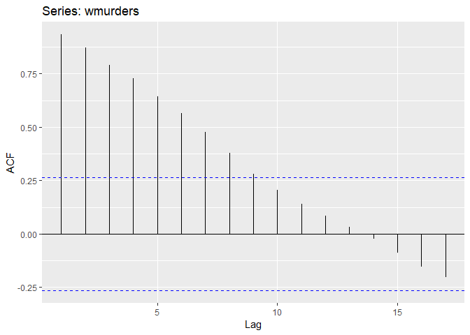<!-- -->

``` r
# Plot differenced murder rate
autoplot(diff(wmurders))
```

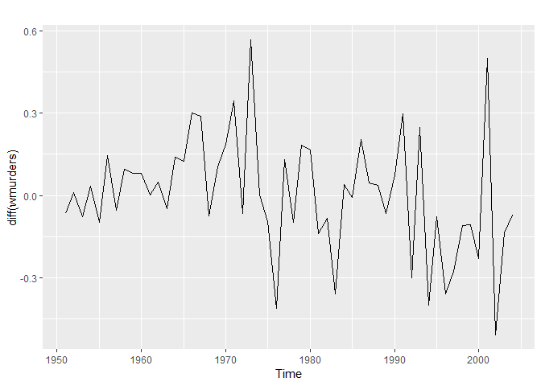<!-- -->

``` r
# Plot ACF of differenced murder rate
ggAcf(diff(wmurders))
```

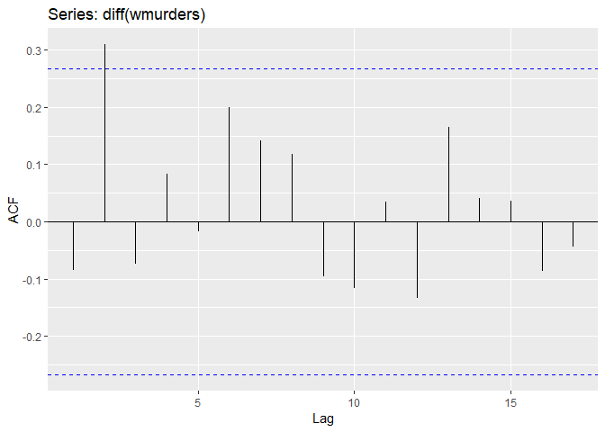<!-- -->

This time series has no significant seasonality but a strong
autocorrelation for shorter lags (above). Lag-1 differencing yields a
more stable series that is by approximation stationary. However, the ACF
of the differenced series does not look like that of white noise because
some values exceed the range marked by the blue lines. Some amount of
autocorrelation remains for short lags.

## Seasonal differencing for stationarity

The Box-Cox transformation was useful in stabilizing the level of
seasonality, improving the stationarity of variance. However, this does
not deal with intracycle variations in level associated with
seasonality. Now we will use the time series of monthly corticosteroid
drug sales in Australia from July 1991 to June 2008, and apply seasonal
differencing to remove the non-stationarity associated with seasonality.

``` r
# Plot h02 data
autoplot(h02) +
  ggtitle("Original h02 series")
```

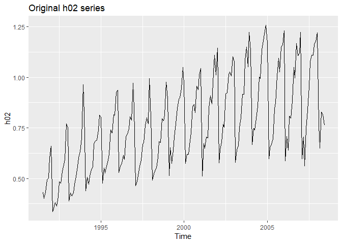<!-- -->

``` r
# Take logs and seasonal differences of h02
difflogh02 <- diff(log(h02), lag = 12)

# Plot difflogh02
autoplot(difflogh02)
```

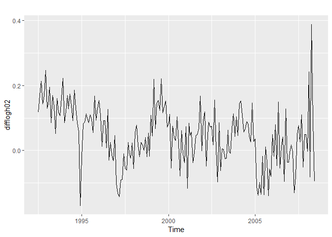<!-- -->

``` r
# Plot ACF
ggAcf(difflogh02) +
  ggtitle("ACF of log(h02) series after 12-month seasonal differencing")
```

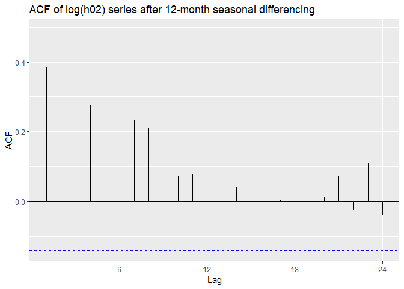<!-- -->

Seasonal differencing of the log-transformed series removed the annual
seasonality. This is illustrated by the ACF (above) where the
autocorrelation for the 12-month lag is no longer significant. Next, we
can improve the non-seasonal stability by taking the lag-1 differences
of the seasonally differenced log-transformed series that we created
(below).

``` r
# Take lag-1 difference
ddifflogh02 <- diff(difflogh02, lag = 1)
autoplot(ddifflogh02)
```

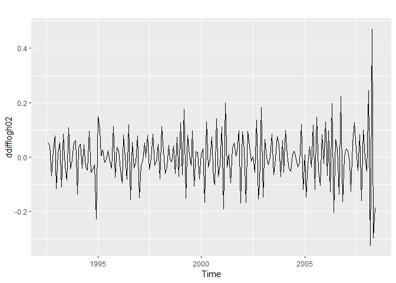<!-- -->

``` r
# Plot ACF
ggAcf(ddifflogh02) +
  ggtitle("ACF of lag-1 differences of [log(h02) 12-month differenced]")
```

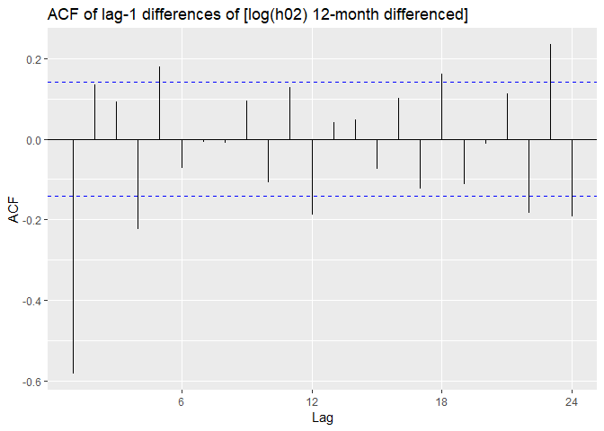<!-- -->

After log-transformation, 12-month seasonal differencing, and lag-1
differencing of the series, autocorrelation has disappeared for most
lags (above). The resulting series is more stable now that we have
rendered it approximately stationary. However, as in the case for the
non-seasonal differencing example, the residuals do not look like white
noise. In fact, there is still significant autocorrelation for shorter
lags that could not be rendered stationary with seasonal differencing.
This is a job for ARIMA (autoregressive integrated moving average)
models.

## ARIMA models

Autoregressive Integrated Moving Average (ARIMA) models use the lag and
shift of in time series data to predict future patterns. The model was
first proposed in 1976 and has gained popularity in economic forecasting
and short-term business performance forecasting. To understand how ARIMA
works, we need to discuss its predecessors because ARIMA combines
components of these earlier models.

  - Autoregressive (AR) models: multiple regression using lagged
    observations as predictors.

  - Moving Average (MA) models: multiple regression using lagged
    residuals (errors) as predictors.

  - Autoregressive Moving Average (ARMA) models: multiple regression
    using both lagged observations and lagged residuals as predictors.
    Accepts only stationary data.

  - Autoregressive Integrated Moving Average (ARIMA{p,d,q}) models: This
    is generalization of the ARMA model with differencing. This allows
    ARIMA to account for non-stationarity in the data. The ARIMA
    parameters (p,d,q) are non-negative integers describing the
    autoregressive, differencing, and moving average terms:
    
      - *p*: order of the autoregressive (AR) model, i.e. the number of
        lagged observations
      - *d*: degree of differencing (I), i.e. the number of differenced
        observations  
      - *q*: order of the moving-average (MA) (or seasonal) model
    
    In addition to (p,d,q), ARIMA models can also include intercepts or
    constants (c), in some cases referred to as the “drift”.

Here are the most common ARIMA model configurations:

  - ARIMA(0,0,0): white noise model
  - ARIMA(0,0,1): first-order moving average (MA) model. Same as MA(1)
  - ARIMA(0,1,0): random walk (if this model uses a constant *c* it
    describes a random walk with drift). Same as I(1). This is
    essentially a stochastic process.
  - ARIMA(0,1,1) without constant: simple exponential smoothing
  - ARIMA(0,1,1) with constant: simple exponential smoothing with growth
  - ARIMA(0,1,2): Damped Holt’s model
  - ARIMA(0,2,1) or (0,2,2) without constant: linear exponential
    smoothing
  - ARIMA(0,2,2): double exponential smoothing
  - ARIMA(0,3,3): triple exponential smoothing
  - ARIMA(1,0,0): first-order autoregressive model. If the series is
    stationary and autocorrelated, and can be predicted as a multiple of
    the last value (plus constant). Same as AR(1)
  - ARIMA(1,1,0): differenced first-order autoregressive model. Used if
    the errors of the random walk model are autocorrelated but without
    seasonality.
  - ARIMA(1,1,2) without constant: damped-trend linear exponential
    smoothing
  - ARIMA(2,1,1): second order autoregressive, first order moving
    average, differenced once

*auto.arima():* The `auto.arima()` function in the `forecast` package
for R can automatically select the best ARIMA model. It conducts a
search over possible models within a set of constraints, and returns the
best ARIMA model according to the AIC<sub>C</sub> (or AIC or BIC) value.

Note that AIC<sub>C</sub> values, like MSE and other performance
metrics, can only be compared between models of the same class. This
means that you:

  - Cannot compare ARIMA AIC<sub>C</sub> with ETS AIC<sub>C</sub>  
  - Cannot compare AIC<sub>C</sub>s for ARIMA models with different
    degrees of differencing (d).

Next, we will fit an automatic ARIMA model to the international visitors
to Australia series.

``` r
# Fit an automatic ARIMA model
fit <- auto.arima(austa)

# Check that the residuals look like white noise
checkresiduals(fit)
```

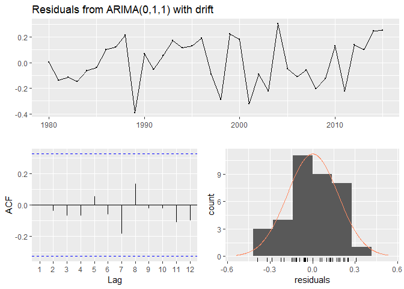<!-- -->

    ## 
    ##  Ljung-Box test
    ## 
    ## data:  Residuals from ARIMA(0,1,1) with drift
    ## Q* = 2.297, df = 5, p-value = 0.8067
    ## 
    ## Model df: 2.   Total lags used: 7

``` r
# Summarize the model
summary(fit)
```

    ## Series: austa 
    ## ARIMA(0,1,1) with drift 
    ## 
    ## Coefficients:
    ##          ma1   drift
    ##       0.3006  0.1735
    ## s.e.  0.1647  0.0390
    ## 
    ## sigma^2 estimated as 0.03376:  log likelihood=10.62
    ## AIC=-15.24   AICc=-14.46   BIC=-10.57
    ## 
    ## Training set error measures:
    ##                        ME      RMSE       MAE       MPE     MAPE      MASE
    ## Training set 0.0008313383 0.1759116 0.1520309 -1.069983 5.513269 0.7461559
    ##                      ACF1
    ## Training set -0.000571993

``` r
# Plot forecasts of fit
fit %>% forecast(h = 10) %>% autoplot()
```

<!-- -->

`auto.arima()` selected an ARIMA(0,1,1) model with drift based on the
lowest AIC<sub>C</sub> value. This codes indicates a simple exponential
smoothing with
growth.

``` r
austa %>% Arima(order = c(0,1,1), include.constant = FALSE) %>% forecast() %>% autoplot() +
  ggtitle("ARIMA(0,1,1) model with no drift (simple exponential smoothing)")
```

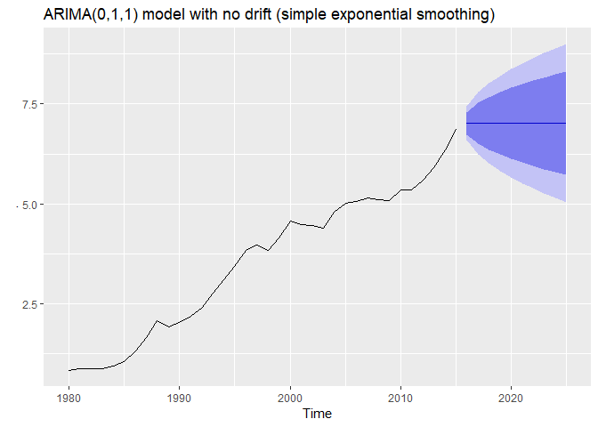<!-- -->

``` r
austa %>% Arima(order = c(2,1,3), include.constant = TRUE) %>% forecast() %>% autoplot() +
  ggtitle("ARIMA(2,1,3) model with drift")
```

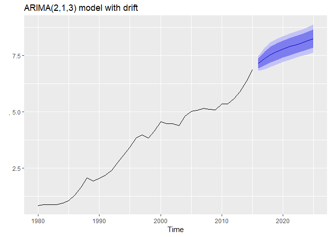<!-- -->

``` r
austa %>% Arima(order = c(0,0,1), include.constant = TRUE) %>% forecast() %>% autoplot() +
  ggtitle("ARIMA(0,0,1) model with constant (first-order moving average)")
```

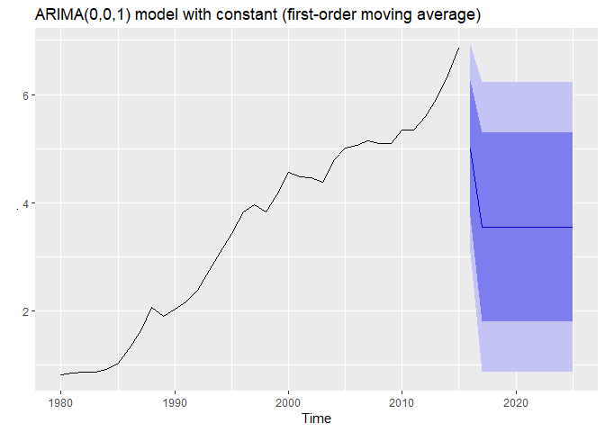<!-- -->

``` r
austa %>% Arima(order = c(0,2,1), include.constant = FALSE) %>% forecast() %>% autoplot() +
  ggtitle("ARIMA(0,2,1) model with no constant (linear exponential smoothing)")
```

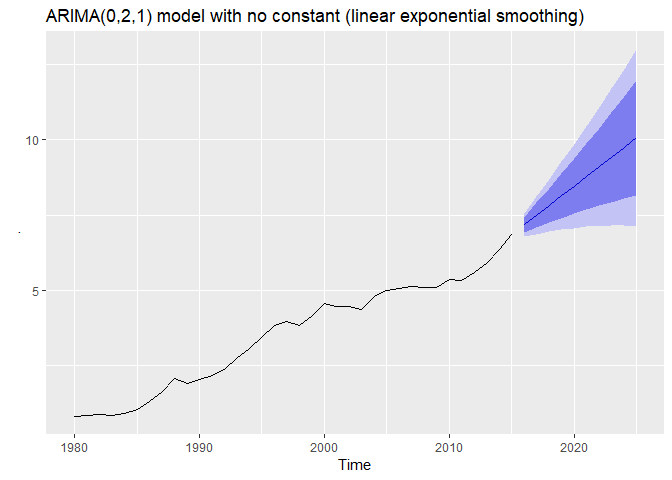<!-- -->

Not all of these models make sense. The ARIMA(0,1,1) model disregards
the trend in the series. There is not enough data to justify the use of
an ARIMA(2,1,3) model–that model is overparameterized. The ARIMA(0,0,1)
model is just as unhelpful as the ARIMA(0,1,1) model. It only use the
historical mean value for all forecasts, and does not take advantage of
the variance in the series. ARIMA(0,1,1) with drift and ARIMA(0,2,1)
seem to provide the best forecasts of these five models.

## Comparing auto.arima() and ets() on non-seasonal data

``` r
# Set up forecast functions
fets <- function(x, h) {
  forecast(ets(x), h = h)
}
farima <- function(x, h) {
  forecast(auto.arima(x), h = h)
}

# Compute CV errors
e1 <- tsCV(austa, fets, h = 1)
e2 <- tsCV(austa, farima, h = 1)

# Compute MSE
mean(e1^2, na.rm = TRUE)
```

    ## [1] 0.05623684

``` r
mean(e2^2, na.rm = TRUE)
```

    ## [1] 0.04336277

``` r
# Plot 10-year forecasts using the best model class
austa %>% farima(h = 10) %>% autoplot()
```

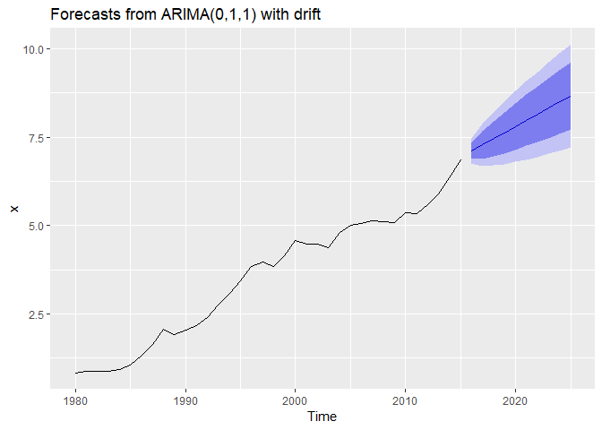<!-- -->

## Seasonal ARIMA models

Seasonal ARIMA models are denoted ARIMA(p,d,q)(P,D,Q)<sub>m</sub>, where
*m* equals the number of time step for each season, and (P,D,Q) describe
the autoregressive, differencing, and moving average terms of the
seasonal equations included in the ARIMA model.

``` r
# Check variance of log-transformed series
h02 %>% log() %>% autoplot()
```

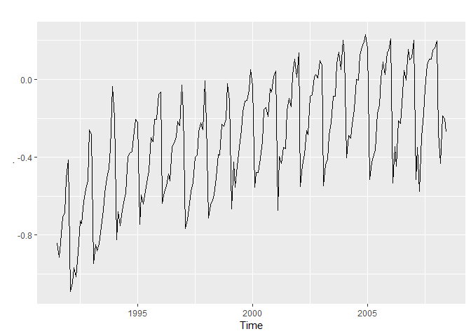<!-- -->

``` r
# Fit a seasonal ARIMA model
fit <- auto.arima(h02, lambda = 0)

# Summarize
summary(fit)
```

    ## Series: h02 
    ## ARIMA(2,1,1)(0,1,2)[12] 
    ## Box Cox transformation: lambda= 0 
    ## 
    ## Coefficients:
    ##           ar1      ar2     ma1     sma1     sma2
    ##       -1.1358  -0.5753  0.3683  -0.5318  -0.1817
    ## s.e.   0.1608   0.0965  0.1884   0.0838   0.0881
    ## 
    ## sigma^2 estimated as 0.004278:  log likelihood=248.25
    ## AIC=-484.51   AICc=-484.05   BIC=-465
    ## 
    ## Training set error measures:
    ##                        ME      RMSE        MAE        MPE     MAPE
    ## Training set -0.003931805 0.0501571 0.03629816 -0.5323365 4.611253
    ##                   MASE         ACF1
    ## Training set 0.5987988 -0.003740267

``` r
# Plot 2-year forecasts
fit %>% forecast(h = 24) %>% autoplot() + 
  ggtitle("2 year forecast of monthly corticosteroid drug sales in Australia")
```

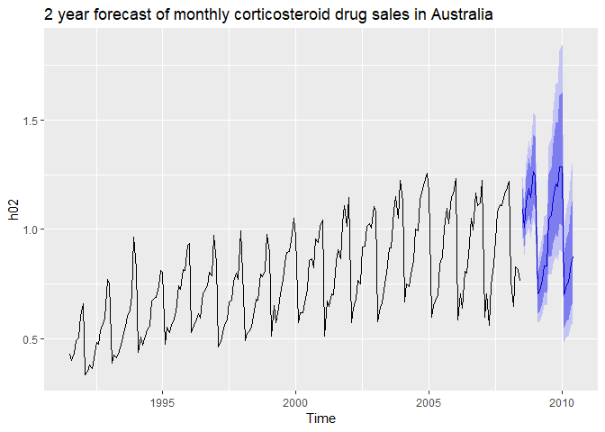<!-- -->

`auto.arima()` found that the ARIMA(2,1,1)(0,1,2) model provided the
best fit for the monthly series of corticosteroid drug sales in
Australia (above). The (p,d,q) = (2,1,1) parameter set represents a
second order autoregressive, first order moving average model,
differenced once to induce stationarity. The (P,D,Q) = (0,1,2) parameter
set indicates that a Damped Holt’s model was used to model the seasonal
part of the ARIMA model.

Another example (below) illustrates ARIMA forecasting of quarterly
retail in the 17 countries of the Euro area. This time, rather than
conduction a stepwise model selection we force `auto.arima()` to search
over all models. More calculations are needed for a full search but it
can result in a better model. However, it appears that in this case the
stepwise selection already identified the best model.

``` r
# Find ARIMA model for euretail
fit1 <- auto.arima(euretail)
summary(fit1)
```

    ## Series: euretail 
    ## ARIMA(0,1,3)(0,1,1)[4] 
    ## 
    ## Coefficients:
    ##          ma1     ma2     ma3     sma1
    ##       0.2630  0.3694  0.4200  -0.6636
    ## s.e.  0.1237  0.1255  0.1294   0.1545
    ## 
    ## sigma^2 estimated as 0.156:  log likelihood=-28.63
    ## AIC=67.26   AICc=68.39   BIC=77.65
    ## 
    ## Training set error measures:
    ##                       ME      RMSE       MAE         MPE      MAPE
    ## Training set -0.02965298 0.3661147 0.2787802 -0.02795377 0.2885545
    ##                   MASE        ACF1
    ## Training set 0.2267735 0.006455781

``` r
# Don't use a stepwise search
fit2 <- auto.arima(euretail, stepwise = FALSE)
summary(fit2)
```

    ## Series: euretail 
    ## ARIMA(0,1,3)(0,1,1)[4] 
    ## 
    ## Coefficients:
    ##          ma1     ma2     ma3     sma1
    ##       0.2630  0.3694  0.4200  -0.6636
    ## s.e.  0.1237  0.1255  0.1294   0.1545
    ## 
    ## sigma^2 estimated as 0.156:  log likelihood=-28.63
    ## AIC=67.26   AICc=68.39   BIC=77.65
    ## 
    ## Training set error measures:
    ##                       ME      RMSE       MAE         MPE      MAPE
    ## Training set -0.02965298 0.3661147 0.2787802 -0.02795377 0.2885545
    ##                   MASE        ACF1
    ## Training set 0.2267735 0.006455781

``` r
# Compute 2-year forecasts
fit2 %>% forecast(h = 8) %>% autoplot() +
  ggtitle("2 year forecast of quarterly retail trade: Euro area")
```

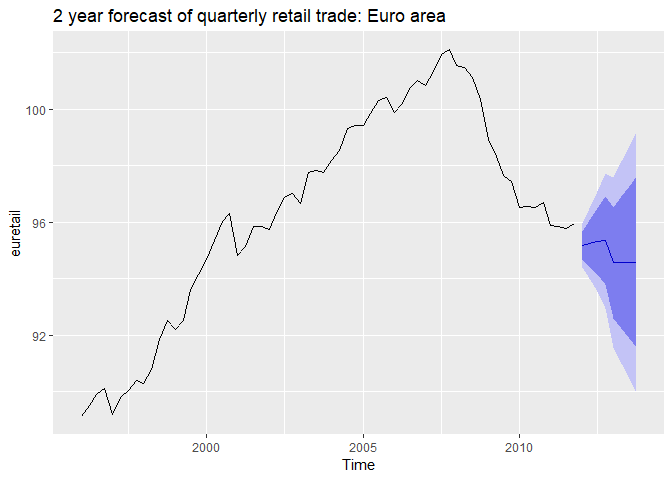<!-- -->

## Comparison of auto.arima() and ets() on seasonal data

``` r
# Create training series
train <- window(qcement, start = c(1988, 1), end = c(2007, 4))

# Fit ARIMA and ETS model
fit1 <- auto.arima(train)
fit2 <- ets(train)

# Check white noise residuals
checkresiduals(fit1)
```

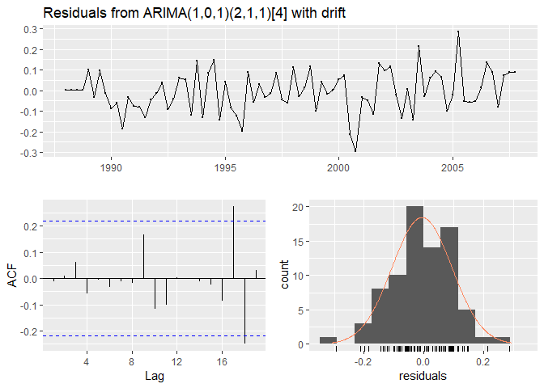<!-- -->

    ## 
    ##  Ljung-Box test
    ## 
    ## data:  Residuals from ARIMA(1,0,1)(2,1,1)[4] with drift
    ## Q* = 3.3058, df = 3, p-value = 0.3468
    ## 
    ## Model df: 6.   Total lags used: 9

``` r
checkresiduals(fit2)
```

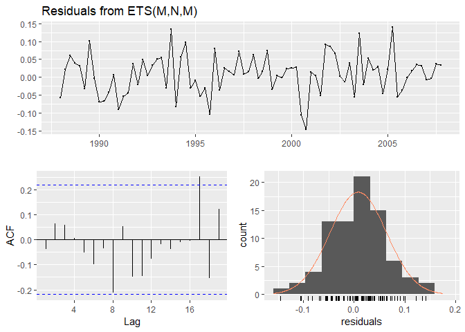<!-- -->

    ## 
    ##  Ljung-Box test
    ## 
    ## data:  Residuals from ETS(M,N,M)
    ## Q* = 6.3457, df = 3, p-value = 0.09595
    ## 
    ## Model df: 6.   Total lags used: 9

``` r
# Forecast
fc1 <- forecast(fit1, h = 25)
fc2 <- forecast(fit2, h = 25)

# Compare RMSE
accuracy(fc1, qcement)
```

    ##                        ME      RMSE        MAE        MPE     MAPE
    ## Training set -0.006205705 0.1001195 0.07988903 -0.6704455 4.372443
    ## Test set     -0.158835253 0.1996098 0.16882205 -7.3332836 7.719241
    ##                   MASE        ACF1 Theil's U
    ## Training set 0.5458078 -0.01133907        NA
    ## Test set     1.1534049  0.29170452 0.7282225

``` r
accuracy(fc2, qcement)
```

    ##                       ME      RMSE        MAE        MPE     MAPE
    ## Training set  0.01406512 0.1022079 0.07958478  0.4938163 4.371823
    ## Test set     -0.13495515 0.1838791 0.15395141 -6.2508975 6.986077
    ##                   MASE        ACF1 Theil's U
    ## Training set 0.5437292 -0.03346295        NA
    ## Test set     1.0518075  0.53438371  0.680556

The ETS model gives the best performance with a lower RMSE for the test
set than the ARIMA model. However, the difference in performance is
small, and both models do a good job given that the autocorrelation of
residuals closely resembles that of white noise.
