5 Dynamic/harmonic regression and TBATS
================

Author: Dennis W. Hallema

Description: Demonstration of advanced time series forecasting methods
based on ARIMA. Examples include dynamic regression which uses external
regressors, and dynamic harmonic regression, which additionally accounts
for seasonality. (Inspired on a DataCamp course, own notes and
solutions.)

Disclaimer: Use at your own risk. No responsibility is assumed for a
user’s application of these materials or related materials.

-----

## Dynamic regression

In ARIMA modeling, time series forecasts are based on historical data of
the same time series. If external time series are available, we can use
the additional information to create a dynamic regression model. Dynamic
regression models the predictor variable as a function of explanatory
variables as in ordinary regression, but additionally we model the error
term with an ARIMA process that integrates the historical information of
the predictor variable.

``` r
# Load packages
library(fpp2)

# Time plot of both variables
autoplot(advert, facets = TRUE)
```

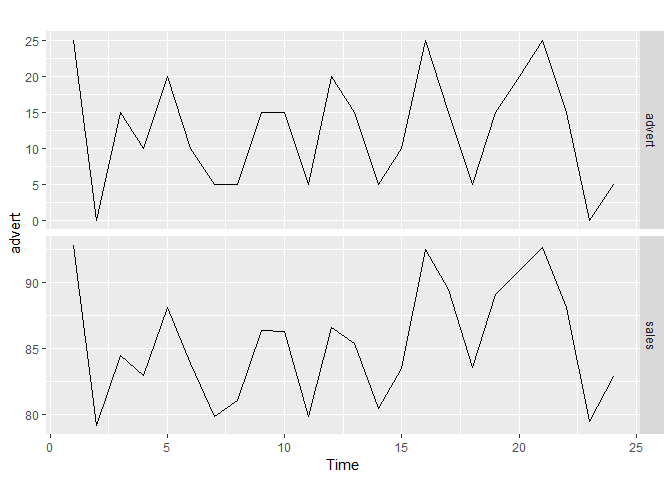<!-- -->

``` r
# Fit ARIMA model
fit <- auto.arima(advert[, "sales"], xreg = advert[, "advert"], stationary = TRUE)

# Summarize the ARIMA model
summary(fit)
```

    ## Series: advert[, "sales"] 
    ## Regression with ARIMA(1,0,0) errors 
    ## 
    ## Coefficients:
    ##          ar1  intercept   xreg
    ##       0.7247    79.2725  0.508
    ## s.e.  0.1339     0.7349  0.022
    ## 
    ## sigma^2 estimated as 1.116:  log likelihood=-34.15
    ## AIC=76.29   AICc=78.4   BIC=81
    ## 
    ## Training set error measures:
    ##                       ME     RMSE       MAE         MPE      MAPE
    ## Training set -0.03570439 0.988353 0.7612276 -0.06588987 0.8951198
    ##                   MASE       ACF1
    ## Training set 0.1650164 0.02381244

``` r
salesincrease <- coefficients(fit)[3]

# Check model residuals
checkresiduals(fit)
```

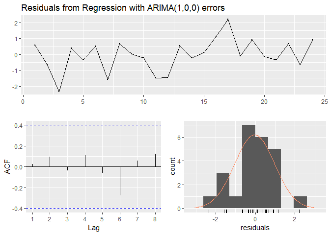<!-- -->

    ## 
    ##  Ljung-Box test
    ## 
    ## data:  Residuals from Regression with ARIMA(1,0,0) errors
    ## Q* = 3.465, df = 3, p-value = 0.3253
    ## 
    ## Model df: 3.   Total lags used: 6

``` r
# Forecast fit as fc
fc <- forecast(fit, xreg = rep(10, 6))

# Plot fc 
autoplot(fc) + xlab("Month") + ylab("Sales") + ggtitle("Dynamic regression forecasts of sales for 10 advertising units/month")
```

<!-- -->

In the above example we use the `auto.arima()` function to fit a dynamic
regression model to monthly sales and advertising expenditure series for
an automotive parts company. We intend to spend 10 units of advertising
expenditure per month over the next two quarters.

  - The regression part of the model fitted a coefficient of 0.508
    (xreg), meaning that sales volume is predicted to increase by 0.508
    volume units per unit increase in advertising units.

  - The residuals of the regression model were modeled with an
    ARIMA(1,0,0) model, which is a first-order autoregressive model
    AR(1).

  - We cannot reject the null hypothesis of indepence of residuals
    because the Ljung-Box test yield a p-value \> 0.05. This signifies
    that the residuals are not significantly autocorrelated and indeed
    look like white noise. This is also confirmed by the ACF plot, where
    the estimated autocorrelation function remains within the range
    expected for a white noise function (marked with the blue lines) for
    all lags. White noise residuals contain no information we can use to
    further improve the model, therefore we consider this dynamic
    regression model a good model.

  - The forecast suggests that if we maintain 10 units of advertising
    expenditure per month over the next half year, we may expect sales
    to continue increasing initially.

<!-- end list -->

``` r
elec <- elecdemand

# Time plots
autoplot(elec[, c("Demand", "Temperature")], facets = TRUE)
```

    ## Warning: Ignoring unknown parameters: series

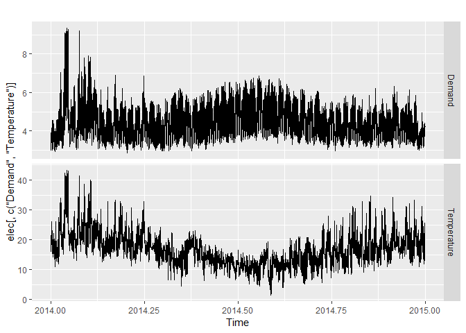<!-- -->

``` r
# Matrix of regressors
xreg <- cbind(MaxTemp = elec[, "Temperature"], 
              MaxTempSq = elec[, "Temperature"]^2, 
              Workday = elec[, "WorkDay"])

# Fit model
fit <- auto.arima(elec[, "Demand"], xreg = xreg)

# Forecast one day ahead
forecast(fit, xreg = cbind(20, 20^2, 1), h = 1)
```

    ## Warning in forecast.Arima(fit, xreg = cbind(20, 20^2, 1), h = 1): xreg
    ## contains different column names from the xreg used in training. Please
    ## check that the regressors are in the same order.

    ##      Point Forecast    Lo 80    Hi 80    Lo 95    Hi 95
    ## 2015       4.169319 4.050753 4.287884 3.987988 4.350649

``` r
# Plot
autoplot(fc) + xlab("Day") + ylab("Electricity demand") + ggtitle("Dynamic regression forecasts of electricity demand for Tmax = 20 degC")
```

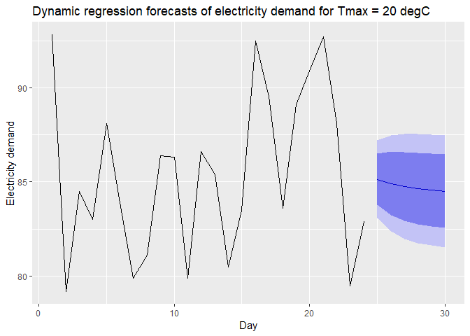<!-- -->

## Dynamic harmonic regression (combines ARIMA and Fourier)

Seasonality can have many components. In addition to modeling
seasonality with an ARIMA model, we can also chose model seasonality by
fitting a Fourier series and then use these as the dynamic regressors to
the ARIMA model. A Fourier transform decomposes the time series into a
set of constituent frequencies described by sines and cosines. The
advantages of using Fourier transformation for seasonality instead of
ARIMA seasonality are:

  - Fourier often calculates faster. While ARIMA has the ability to
    model seasonality patterns that evolve with time, many forms of
    seasonality consist of complex cycles with long periods. Fourier
    characterizes these long cycles better and faster.

  - Fourier can compute periods with a non-integer length. For example,
    for a series with a daily time step, Fourier can characterize cycles
    with a period of 3.5 days if they occur.

The maximum order of Fourier terms *K* can be set high, however it is
necessary to stop increasing *K* once the AIC<sub>C</sub> has attained a
minimum. In dynamic harmonic regression we do not need ARIMA to
calculate seasonality because the Fourier function already models
seasonality.

``` r
# Set up harmonic regressors of order 13
harmonics <- fourier(gasoline, K = 13)

# Fit regression model with ARIMA errors
fit <- auto.arima(gasoline, xreg = harmonics, seasonal = FALSE)

# Check residuals
checkresiduals(fit)
```

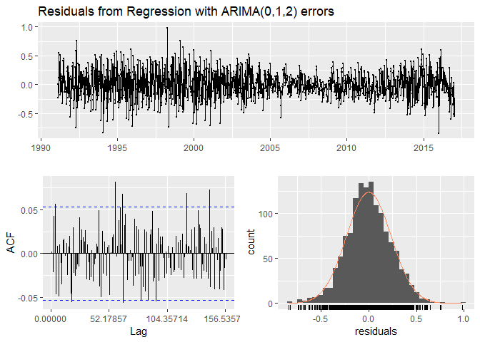<!-- -->

    ## 
    ##  Ljung-Box test
    ## 
    ## data:  Residuals from Regression with ARIMA(0,1,2) errors
    ## Q* = 132.3, df = 75.357, p-value = 5.591e-05
    ## 
    ## Model df: 29.   Total lags used: 104.357142857143

``` r
# Forecasts next 3 years
newharmonics <- fourier(gasoline, K = 13, h = 3*52)
fc <- forecast(fit, xreg = newharmonics)

# Plot forecasts fc
autoplot(fc) + xlab("Time") + ylab("Million barrels/day") + 
  ggtitle("Dynamic harmonic regression forecasts of US finished motor gasoline product")
```

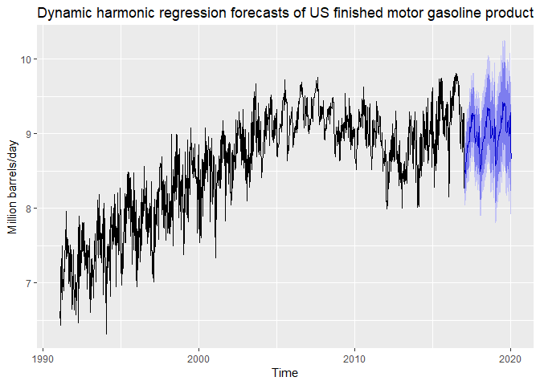<!-- -->

``` r
# Fit a harmonic regression using order 10 for each type of seasonality
fit <- tslm(taylor ~ fourier(taylor, K = c(10, 10)))

# Forecast 20 working days ahead
fc <- forecast(fit, newdata = data.frame(fourier(taylor, K = c(10, 10), h = 20 * 48)))

# Check the residuals
checkresiduals(fit)
```

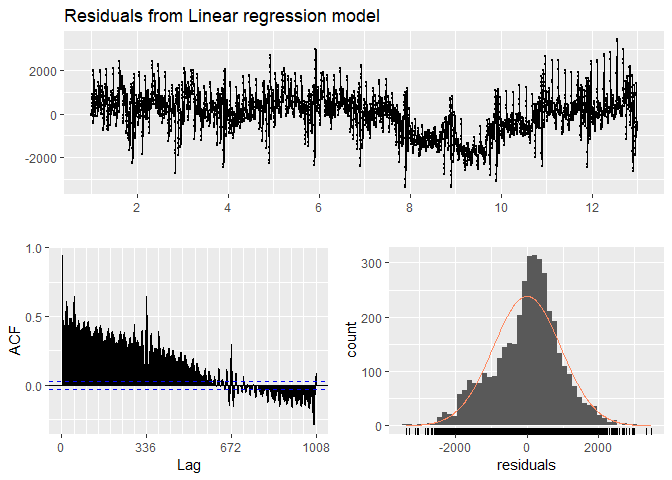<!-- -->

    ## 
    ##  Breusch-Godfrey test for serial correlation of order up to 672
    ## 
    ## data:  Residuals from Linear regression model
    ## LM test = 3938.9, df = 672, p-value < 2.2e-16

``` r
# Plot forecasts
autoplot(fc)
```

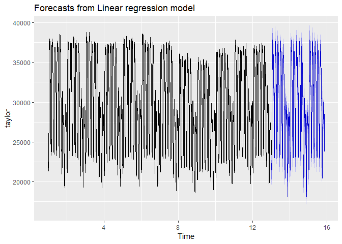<!-- -->

``` r
# Plot the calls data
autoplot(calls)
```

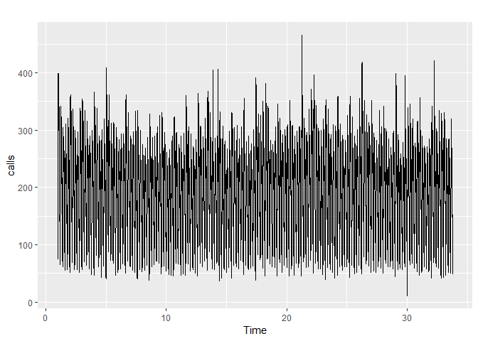<!-- -->

``` r
# Set up the xreg matrix
xreg <- fourier(calls, K = c(10, 0))

# Fit a dynamic regression model
fit <- auto.arima(calls, xreg = xreg, seasonal = FALSE, stationary = TRUE)

# Check the residuals
checkresiduals(fit)
```

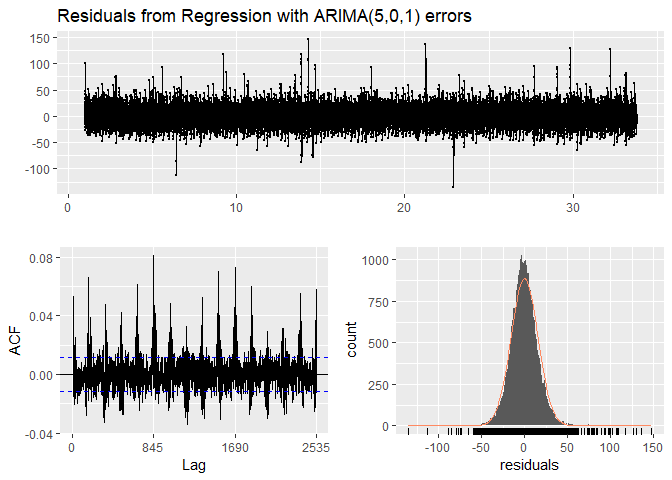<!-- -->

    ## 
    ##  Ljung-Box test
    ## 
    ## data:  Residuals from Regression with ARIMA(5,0,1) errors
    ## Q* = 6846.8, df = 1663, p-value < 2.2e-16
    ## 
    ## Model df: 27.   Total lags used: 1690

``` r
# Plot forecasts for 10 working days ahead
# 169 5-minute periods in a working day
fc <- forecast(fit, xreg = fourier(calls, c(10, 0), h = 10 * 169))
autoplot(fc)
```

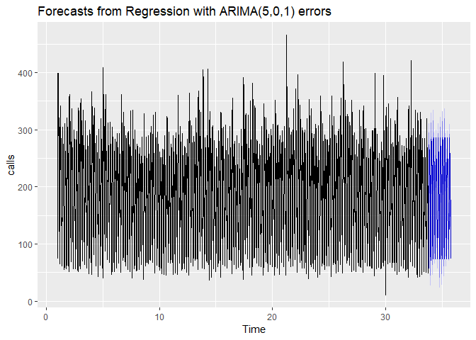<!-- -->

## TBATS models

A TBATS model combines the models we discussed into one single
framework. TBATS accounts for:

  - **T**rigonometric terms for seasonality (Fourier)  
  - **B**ox-Cox transformations to model heteroskedasticity  
  - **A**RMA errors
  - **T**rend, including damping  
  - **S**easonality with multiple periods

TBATS is a fully automated model, and this can be helpful in
forecasting. The drawbacks of TBATS are that it requires much computing
power, and the best model is not always identified.

``` r
# Plot the gas data
autoplot(gas)
```

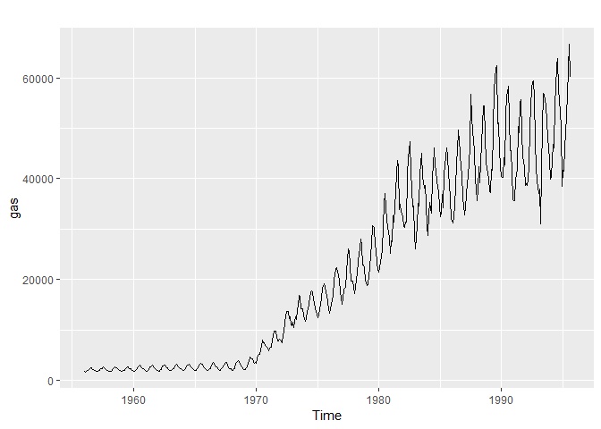<!-- -->

``` r
# Fit a TBATS model to the gas data
fit <- tbats(gas)

# Forecast the series for the next 5 years
fc <- forecast(fit, h = 5 * 12)

# Plot the forecasts
autoplot(fc)
```

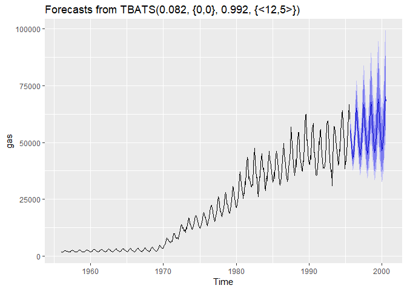<!-- -->

This is a TBATS(0.082, {0,0}, 0.992, {\<12,5\>}) model. Each number
describes a model parameter:

  - 0.082: Box-Box lambda transformation parameter. This value suggest a
    strong increase in variance with time.
  - {0,0}: These are the (p,q) parameters, indicating that no ARMA term
    was used.
  - 0.992: Damping parameter
  - {\<12,5\>}: Fourier parameters indicate a 12-month cycle with 5 as
    the maximum order of Fourier terms (complexity).
